# 功能流程图文档

## 系统整体功能架构

```
┌─────────────────────────────────────────────────────────────┐
│                   百度百科风格百科系统                        │
├─────────────────────────────────────────────────────────────┤
│                                                             │
│  ┌─────────────┐  ┌─────────────┐  ┌─────────────┐        │
│  │   前台功能   │  │   用户功能   │  │   后台功能   │        │
│  └─────────────┘  └─────────────┘  └─────────────┘        │
│                                                             │
└─────────────────────────────────────────────────────────────┘
```

## 1. 词条浏览流程图

### 1.1 词条列表浏览流程

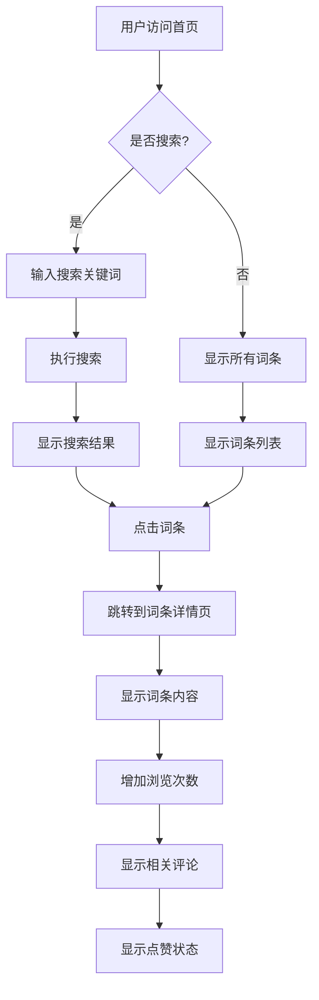

### 1.2 分类浏览流程

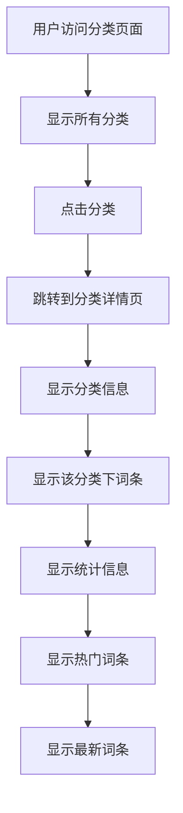

## 2. 词条管理流程图

### 2.1 创建词条流程

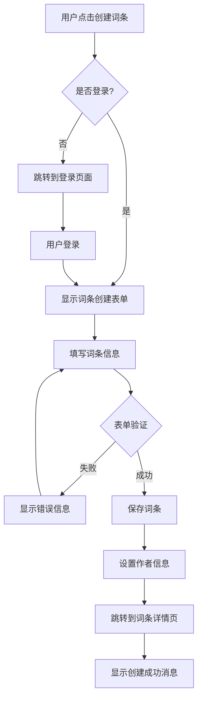

### 2.2 编辑词条流程

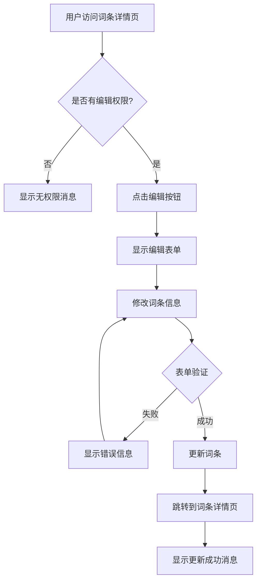

### 2.3 删除词条流程

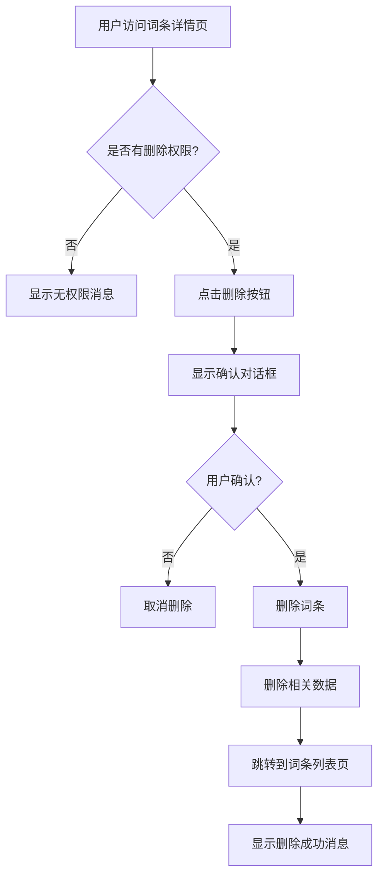

## 3. 搜索功能流程图

### 3.1 搜索执行流程

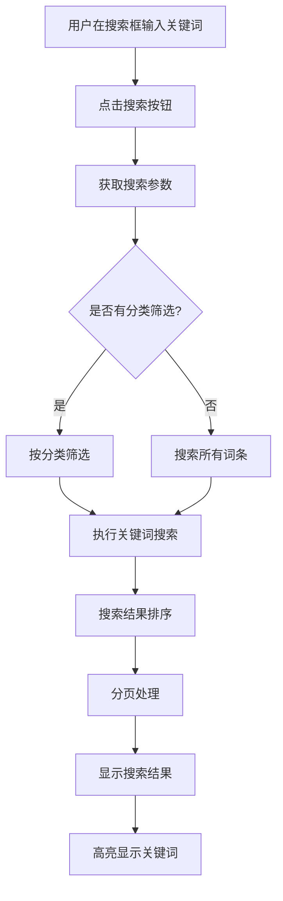

## 4. 用户交互流程图

### 4.1 点赞流程

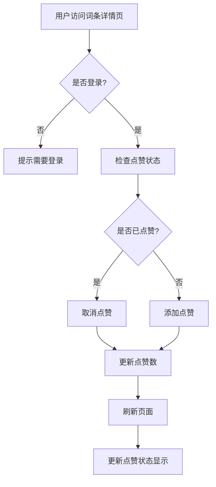

### 4.2 评论流程

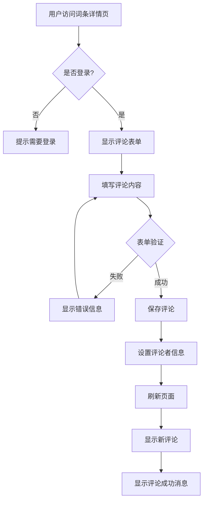

## 5. 用户认证流程图

### 5.1 用户登录流程

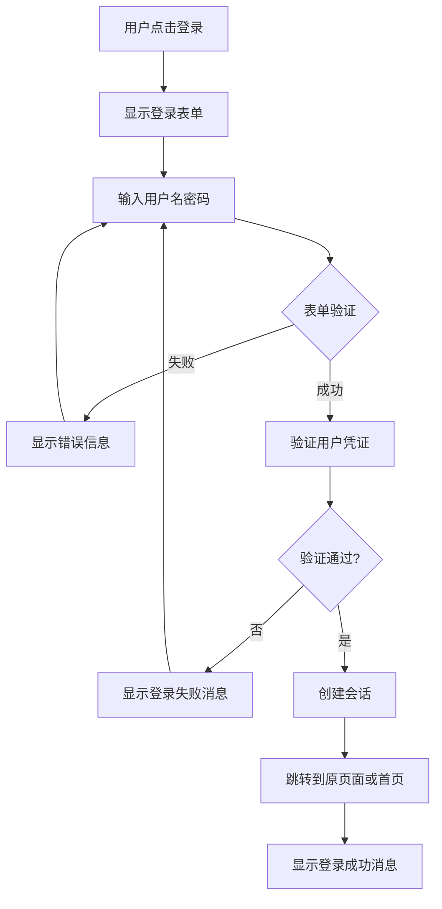

### 5.2 用户注册流程

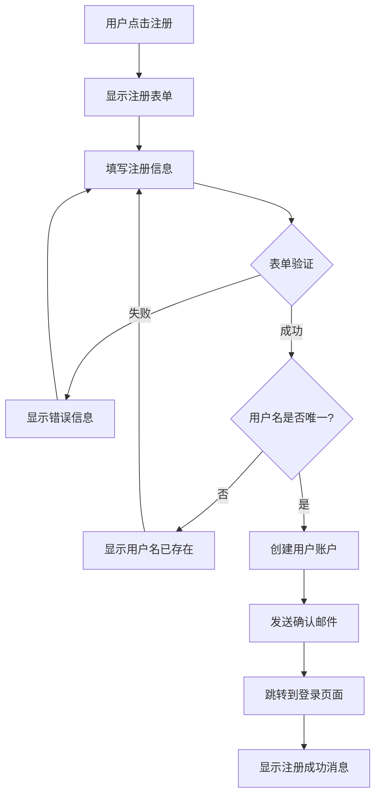

## 6. 后台管理流程图

### 6.1 管理员登录流程

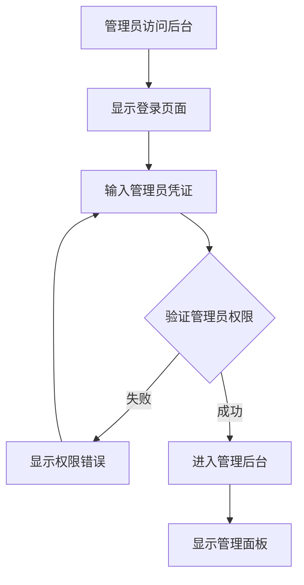

### 6.2 数据管理流程

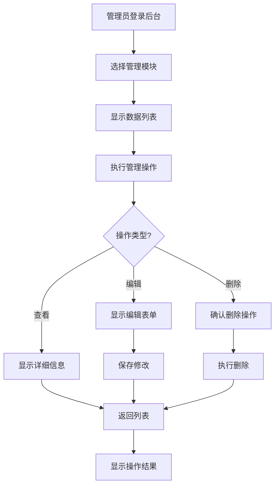

## 7. 系统异常处理流程

### 7.1 404错误处理流程

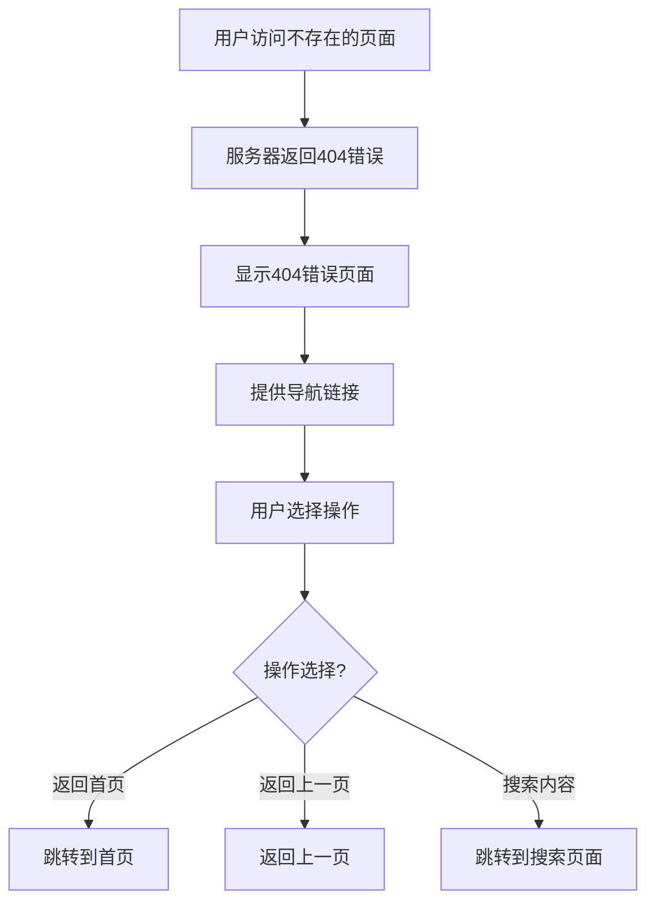

### 7.2 权限错误处理流程

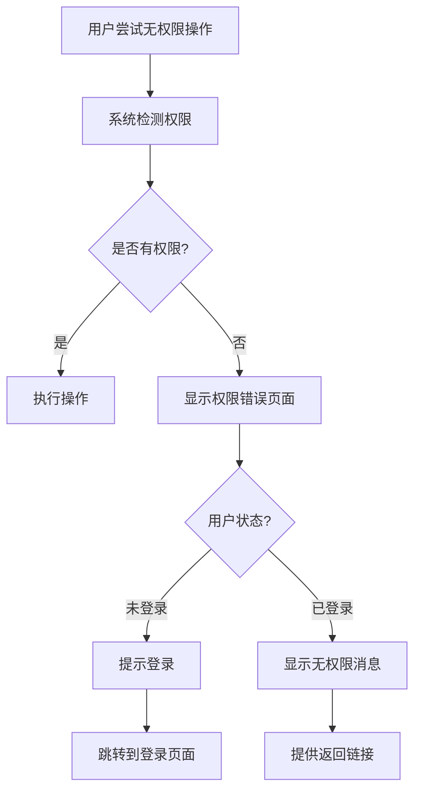

## 8. 数据流图

### 8.1 词条数据流

```
用户输入
    ↓
表单验证
    ↓
数据清洗
    ↓
数据库存储
    ↓
数据展示
    ↓
用户反馈
```

### 8.2 搜索数据流

```
用户输入关键词
    ↓
关键词处理
    ↓
数据库查询
    ↓
结果排序
    ↓
分页处理
    ↓
结果展示
    ↓
关键词高亮
```

## 9. 状态转换图

### 9.1 词条状态转换

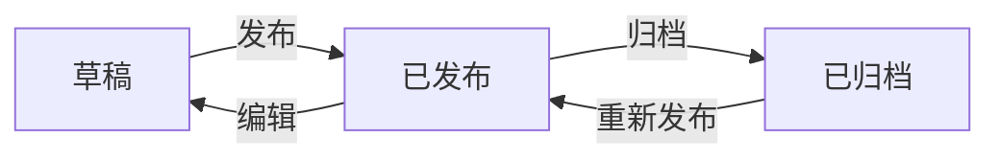

### 9.2 用户会话状态

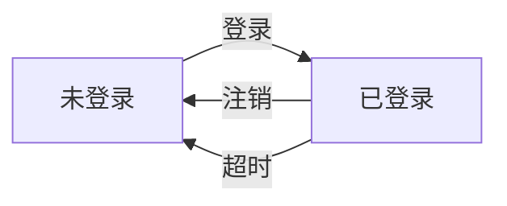

## 功能模块交互关系

### 模块依赖关系

```
用户认证模块
    ↓
词条管理模块 ←→ 分类管理模块
    ↓
搜索功能模块
    ↓
用户交互模块
    ↓
后台管理模块
```

### 数据流向

```
用户输入 → 前端验证 → 后端处理 → 数据库操作
    ↓
数据返回 → 前端展示 → 用户反馈
```

这个功能流程图文档详细描述了系统的各个功能模块的工作流程，包括正常流程和异常处理流程，为系统开发和维护提供了清晰的指导。